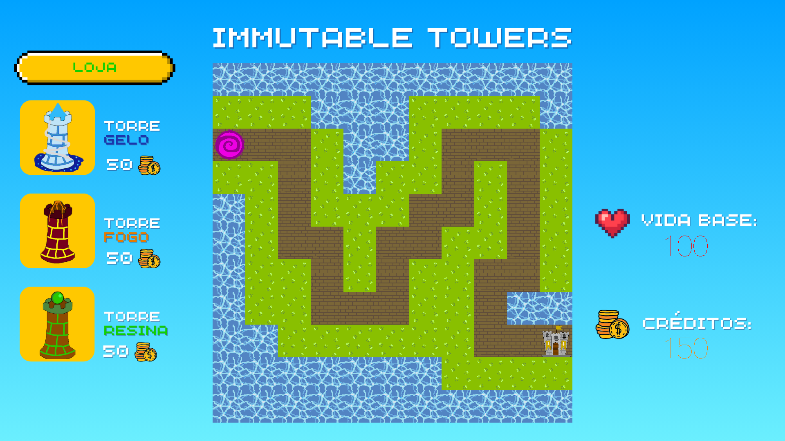

# Laboratórios de Informática I

Immutable Towers é um jogo do gênero [Tower Defense](https://en.wikipedia.org/wiki/Tower_defense), desenvolvido em Haskell no âmbito da cadeira Laboratórios de Informática I, do curso de Engenharia de Software na Universidade do Minho (ano letivo 2024/25).
O objetivo do jogo é impedir que ondas de inimigos alcancem a base do jogador. Para isso, é necessário posicionar estrategicamente torres que atacam automaticamente os inimigos, evitando que estes destruam a base.

## Imagens do jogo

### Menu Inicial


### Texturas

O jogo permite ao jogador escolher entre duas opções de textura, acessíveis através do menu de texturas. A diferença visual entre elas pode ser observada nas imagens abaixo:




### Menu Niveis

O jogo permite ao jogador escolher entre três níveis distintos, acessíveis através do menu de seleção de nível. Inicialmente, apenas o nível 1 está disponível. À medida que o jogador vence cada nível, os seguintes são desbloqueados progressivamente.


### Funcionalidades Extras

As funcionalidades extras podem ser consultadas [aqui](app/EXTRAS.md).

### Situação de jogo - Nível 1


### Situação de jogo - Nível 2


### Situação de jogo - Nível 3


## Desenvolvido por

- [Matheus Monteiro Azevedo](https://github.com/matheusm18) - a111430
- [Francisco Luciano Martins](https://github.com/XicoMartins54) - a111775

## Executável

Pode compilar e executar o programa através dos comandos `build` e `run` do Cabal.

```bash
cabal run --verbose=0
```

## Interpretador

Para abrir o interpretador do Haskell (GHCi) com o projeto carregado, utilize o comando `repl` do Cabal

```bash
cabal repl
```

## Testes

O projecto utiliza a biblioteca [HUnit](https://hackage.haskell.org/package/HUnit) para fazer testes unitários.

Execute os testes com o comando `test` do Cabal e utilize a flag `--enable-coverage` para gerar um relatório de cobertura de testes.

```bash
cabal test --enable-coverage
```

Execute os exemplos da documentação como testes com a biblioteca
[`doctest`](https://hackage.haskell.org/package/doctest). Para instalar o
executavel utilize o comando `cabal install doctest`.

```bash
cabal repl --build-depends=QuickCheck,doctest --with-ghc=doctest --verbose=0
```

## Documentação

A documentação do projeto pode ser gerada recorrendo ao [Haddock](https://haskell-haddock.readthedocs.io/).

```bash
cabal haddock
```
